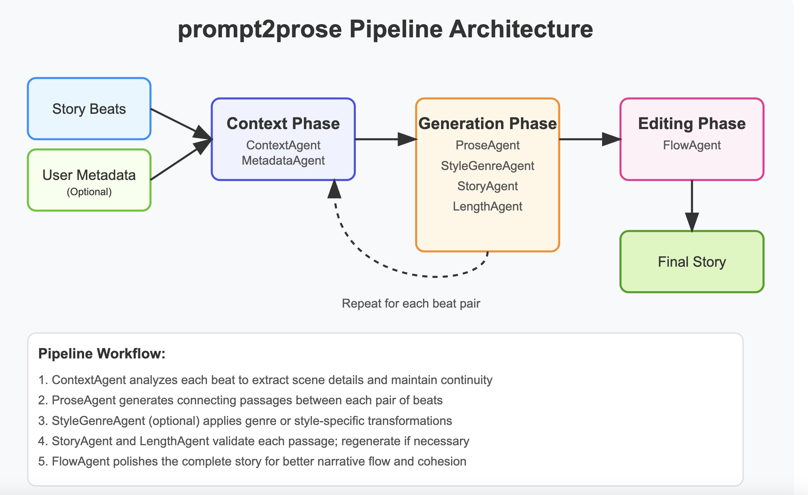

# prompt2prose
The prompt2prose system uses a light-weight multi-agentic pipeline to transform simple story beats into coherent, polished narratives.



This repo also contains a dockerfile users can download alongside the code and run the experiment with prompt2pose models. This docker will serve users with an agentic workflow which will generate stories from beats or from metadata.

## How to run
To run, users should install docker locally on their machine and make an account. Once docker in installed, the dockerfile must be built. To build this docker locally:

`docker build -t image_name .`

Users should input their own `image_name`. I recommend `prompt2prose`

Once the docker is built, run the container with:

`docker run -e OPENAI_KEY='your_openai_api_key' -p 8000:8000 image_name`

This generates several endpoints meant to help aspiring writers flesh out stories and brainstorm creative writing.

## Multi-Agentic Pipeline

The main workflow is orchestrated by the BeatToStory class, which coordinates several specialized AI agents that each handle different aspects of the story creation process:

### Context Generation (get_context())
- The ContextAgent analyzes each beat to extract key scene details
- It builds a JSON representation of the setting (location, important details)
- It tracks characters and their status (on/off stage)
- Each beat's context is compared with the previous beat's context to maintain continuity

### Metadata Enhancement (update_context_with_meta())
- If the user provides metadata, the MetadataAgent enriches the context
- Adds character profiles, setting notes, and other details
- This helps the other agents understand the broader story world

### Story Generation (generate_story())
For each pair of beats, the system:

- Uses ProseAgent to craft a connecting passage (100-150 words)
- Optionally applies genre/style transformations with StyleGenreAgent
- Validates narrative consistency with StoryAgent
- Checks length requirements with LengthAgent
-= If any check fails, it retries up to a configurable number of attempts

### Story Editing (edit_story())

- The FlowAgent performs final editing on the complete story
- It improves language flow, ensures stylistic variation
- Maintains the original plot and context while polishing the text

### Agent Interactions
What makes this system powerful is how the agents build upon each other's work:

1. The ContextAgent outputs structured scene data that helps the ProseAgent maintain continuity
2. The ProseAgent focuses on bridging beats creatively while respecting the established context
3. The StoryAgent and LengthAgent act as quality control, ensuring each passage meets requirements
4. The optional StyleGenreAgent can transform passages to match specific writing styles or genres
5. The FlowAgent takes a holistic view, ensuring the finished story reads smoothly as a complete work

This multi-agent approach leverages the strengths of specialized AI components while maintaining overall narrative coherence, resulting in stories that flow naturally despite being generated from discrete beats.

### Endpoints

This work is divided into two main functionalities.

#### Base Gets
- `GET /` - Returns welcome message and list of available endpoints
- `GET /docs` - Redirects to this documentation
- `GET /beat_to_story/` - Returns details about the beat-to-story generation pipeline

#### BeatToStory
*Get Requests:*
- `/beat_to_story/` - Returns pipeline information including agents, LLMs, and prompts used in story generation

*Post Requests:*
- Endpoint: `/beat_to_story/generate/`
- Method: POST
- Request Body:
```
json
{
    "beats": ["list of story beats"],
    "gen_metadata_flag": boolean (optional, default: false)
}
```
- Response Body:
```
{
    "final_story": "generated story text",
    "final_story_word_count": integer,
    "generation_cost": Dict,
    "generation_time": float,
    "generation_metadata": object (included if gen_metadata_flag=true)
}
```
#### MetaToStory

*Post Requests:*
- Endpoint: `/metadata_to_story/generate/`
- Method: POST
- Request Body:
```
json
{
    "beats": ["list of story beats"],
    "gen_metadata_flag": boolean (optional, default: false)
    "user_metadata": {
        "setting":
            {
                "location": "writer specified place",
                "notes": "about location/scene/chapter"
            },
            "genre": "genre writer is aiming for", #OPTIONAL - note: beats will have a stronger influence so if beats and genre are misaligned this may not work well
            "style": "style writer is aiming for", #OPTIONAL,
            "characters":
                {"name": Character name, "profile": A profile of that character},
                {...}
                }
}
```
- note: for now the fields of the user_metadata are fixed. We expect characters, setting info. If this is too rigid we can expand it. But for a POC, this was a good first pass
- Response Body:
```
{
    "final_story": "generated story text",
    "final_story_word_count": integer,
    "generation_cost": Dict,
    "generation_time": float,
    "generation_metadata": object (included if gen_metadata_flag=true)
}
```
